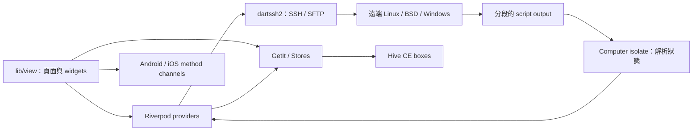

# ServerBox 大模型工程導讀

> 這份文件是給需要閱讀、除錯或修改本倉庫的程式設計型大模型使用的上下文入口，描述目前已保存的 Android 客製化狀態，不是 upstream 功能清單或版本歷史。交付範圍只有 Android app；其他平台目錄僅保留作 upstream 上下文，除非使用者另行要求，不要擴大修改或驗證範圍。若文件與程式碼衝突，以程式碼、`pubspec.yaml`、CI workflow 與 `CLAUDE.md` 為準。

## 先建立心智模型

ServerBox 是一個跨平台 Flutter 應用程式。它把 Linux、BSD/macOS 與 Windows 主機存成 `Spi`，透過 SSH 連線，在遠端安裝／執行狀態蒐集腳本，把帶分隔標記的輸出拉回本機，再於 isolate 中解析成 `ServerStatus`。UI 使用 Riverpod 監聽各伺服器的連線與狀態；長期資料由 Hive CE 儲存，store 透過 GetIt 暴露。

除了狀態監控，應用也提供 SSH terminal、tmux 恢復、SFTP、Docker/Podman、process、systemd、PVE、port forwarding、snippet、備份同步及行動平台原生整合。



## 最重要的入口

| 目的 | 從這裡開始讀 | 說明 |
| --- | --- | --- |
| 程式啟動 | `lib/main.dart` | Flutter binding、Paths、Hive、stores、資料遷移、桌面視窗、isolate workers、session manager |
| App shell | `lib/app.dart`、`lib/intro.dart` | theme、locale、responsive builder、intro migration、`MaterialApp` |
| 首頁 | `lib/view/page/home.dart`、`home_tab.dart` | tabs、生命週期、認證、自動刷新、手機 bottom bar／桌面 rail |
| 所有伺服器狀態 | `lib/data/provider/server/all.dart` | server 清單、排序、CRUD、整批 refresh、auto-refresh timer |
| 單台伺服器狀態 | `lib/data/provider/server/single.dart` | 連線、系統偵測、寫入腳本、抓取狀態、錯誤與重試狀態機 |
| 遠端腳本 | `lib/data/model/app/scripts/` | Linux/BSD/Windows 命令、腳本產生、輸出 separator 與 key mapping |
| 狀態解析 | `lib/data/model/server/server_status_update_req.dart` | `getStatus` 及各平台 parser 的總入口 |
| SSH 認證／跳板 | `lib/core/utils/server.dart`、`ssh_auth.dart`、`ssh_config.dart` | client 建立、host key、password/key、jump host、ProxyCommand |
| SSH terminal | `lib/view/page/ssh/page/`、`lib/data/ssh/` | xterm、session、persistent shell、tmux、輸出緩衝 |
| SFTP | `lib/view/page/storage/sftp.dart`、`lib/data/model/sftp/worker.dart` | 瀏覽器與 isolate 傳輸 worker |
| Container | `lib/data/provider/container.dart`、`lib/view/page/container/` | Docker／Podman 偵測、sudo、操作與 UI |
| 永久儲存 | `lib/data/res/store.dart`、`lib/data/store/` | GetIt 註冊、HiveStore、cache、各 box schema |
| 備份同步 | `lib/core/sync.dart`、`lib/data/model/app/bak/` | v1/v2 格式、加密、merge、WebDAV/Gist/iCloud |
| 平台通道 | `lib/core/chan.dart`、Android `MainActivity.kt`、iOS `AppDelegate.swift` | foreground session、home widget、Live Activity |
| 建置 | `Makefile`、`fl_build.json`、`make.dart`、`packages/fl_build/` | 官方開發、產物打包及 release 前置處理 |

## 啟動順序與生命週期

`lib/main.dart` 的順序有依賴性，不要任意平行化或重排：

1. `_runInZone` 用 guarded zone 收集未處理錯誤到 `Loggers.app`。
2. `_initData` 初始化 app paths、Hive CE、generated adapters、`PrefStore` 與 `Stores`。
3. 所有需要備份的 Hive store 會一起 `init`，然後執行設定與 connection stats migration。
4. `_doDbMigrate` 在任何 provider 被載入前處理版本遷移與 server ID migration。
5. `_initWindow` 只在 desktop 初始化視窗大小、位置和 title bar。
6. `_doPlatformRelated` 設定 Android 高更新率，並依 server 數量啟動 `Computer.shared` isolate workers。
7. `TermSessionManager.init()` 註冊原生平台 session callback。
8. `runApp(ProviderScope(child: MyApp()))` 才建立 Riverpod container。
9. `MyApp` 讀取 store 中的 theme/locale；需要 migration intro 時先顯示 intro，否則進入 `HomePage`。
10. `HomePage.afterFirstLayout` 做生物辨識、home widget 更新、首次 server refresh 與延遲備份同步。此客製版刻意不檢查 upstream App 更新。

行動平台暫停時通常停止 server auto-refresh；恢復時重新啟動並立即 refresh。desktop 不套用這段暫停邏輯。release mode 離開 `HomePage` 時會關閉連線，debug hot reload 則刻意保留。

## 分層與目錄責任

### `lib/core/`

跨 feature 的基礎能力：導航 key、route args、同步、method channel、SSH client extensions、認證、SFTP sudo/timeout、server dedup、平台或 UI utilities。這一層不應依賴具體頁面，除非現有跨切流程已明確需要 UI context。

### `lib/data/model/`

領域模型與 parser：

- `server/`：`Spi`、`ServerStatus`、CPU/memory/disk/network/GPU/battery/process/systemd/PVE 等解析模型。
- `app/scripts/`：遠端狀態腳本 DSL、命令列舉與輸出協定。
- `app/bak/`：備份 schema、加密及 merge。
- `container/`、`sftp/`、`ssh/`：各 feature 的 request、state 或 value objects。

不要把網路連線或 widget 邏輯塞進純 parser。大量 parser 可直接用 Dart/Flutter unit test 驗證。

### `lib/data/provider/`

Riverpod 產生式 state management：

- `serversProvider` 是全域 server 清單、順序、tags 與 auto-refresh timer。
- `serverProvider(serverId)` 是單台 server family，持有 `Spi`、`ServerStatus`、`ServerConn` 與目前 `SSHClient`。
- `containerProvider`、`pveProvider`、`systemdProvider` 等是依 server 或頁面生命週期建立的 feature provider。
- `sftpProvider` 是 keep-alive transfer queue；實際傳輸在 worker isolate。
- `privateKeyProvider`、`snippetProvider` 讓 Hive 資料反映到 UI state。

provider 檔案旁的 `*.g.dart`、`*.freezed.dart` 是產生物，不可手改。

### `lib/data/store/`

永久資料使用 `hive_ce`／`hive_ce_flutter`，不是舊的 `hive` package。`Stores.init()` 在 GetIt 註冊 store singleton，再初始化所有需備份的 boxes。

`CachedHiveStore<T>` 為 server、private key、snippet 提供 list cache；所有 put/update/delete 都必須使 cache 失效。直接修改 box 會觸發 watch 並清 cache，但除非是在 migration，優先使用 store API。

主要 store：

- `SettingStore`：大量 typed `propertyDefault`／`listProperty`，UI 常直接監聽 property listenable。
- `ServerStore`：`Spi`，key 是短 ID；含舊 `user@ip:port` ID migration。
- `ContainerStore`、`PrivateKeyStore`、`SnippetStore`、`HistoryStore`。
- `ConnectionStatsStore`：連線歷史與索引。
- `PortForwardStore`。

敏感值使用 `SecureStoreProps`／`SecureProp`，例如備份密碼；不要新增明文設定來存 token、password 或 private material。

### `lib/view/`

頁面與元件。首頁不是 declarative router；多數頁面在 class 上宣告 `static const route = AppRoute...`（實作來自 `fl_lib`），再呼叫 `Page.route.go(context, args: ...)`。`AppNavigator.key` 只供需要全域 context 的跨切流程。

現有 UI 通常以同檔 private `extension on StateClass` 分成 Widget build、Actions、Utils。新增功能應延續這個模式，優先使用 `fl_lib` 的 `CustomAppBar`、`Input`、dialog、button 與 store widgets。

## 核心資料結構

### `Spi`

`lib/data/model/server/server_private_info.dart` 的 `Spi` 是 server 的持久設定，包含短 ID、名稱、IP/host、port、user、password、private key、tags、jump IDs、ProxyCommand、Wake-on-LAN、自動連線、自訂命令與環境等。

注意事項：

- 新增或更新前呼叫 `validateOrThrow()`。
- `id` 是關聯主鍵，會被 server order、jump chain、snippet auto-run、container host 與 session ID 使用。
- 修改 ID 必須走 `ServersNotifier.updateServer`；它會同步關聯資料並清掉舊 session。
- `jumpId` 是 legacy 單值，`jumpIds` 是目前的 chain/failover 表示；讀取時使用 `resolvedJumpIds`。
- 不允許 jump server 與 ProxyCommand 同時衝突。

### `ServerState` 與 `ServerConn`

單台 server 的 runtime state 不寫回 Hive：

```text
disconnected -> connecting -> connected -> loading -> finished
                         \-> failed
```

`finished` 代表已有可展示的完整狀態。`TryLimiter` 抑制持續失敗的重試；只有成功完成準備與解析才 reset。手動 disconnect 的 ID 另外保存在 `ServersState.manualDisconnectedIds`，避免下一輪全域 refresh 立刻重連。

### `ServerStatus`

`ServerStatus` 聚合 CPU、memory、swap、disk、disk I/O、network、TCP、temperature、SMART、NVIDIA/AMD GPU、battery、sensors、custom commands 與 errors。

CPU、network speed、disk I/O 會保留前一輪物件引用，以計算 delta/history；其他容易過期的欄位每輪先重建。修改 parser 時不要盲目把全部欄位改成全新 immutable object，否則速率計算會失去前一筆資料。

## Server status 的完整資料流

1. `HomePage` 或 UI 呼叫 `serversProvider.notifier.refresh()`。
2. 全域 notifier 過濾手動斷線、禁止 auto-connect 或 `onlyFailed` 不符合者。
3. 對每個 ID 呼叫 `serverProvider(id).notifier.refresh()`；同一台用 `_isRefreshing` 防重入。
4. 尚未連線時，`genClient` 依 `Spi` 建立 SSH client，可處理密碼、key、keyboard-interactive、host key、jump chain 或 ProxyCommand。
5. `SystemDetector` 判斷 Linux、BSD 或 Windows。
6. `ShellFuncManager.allScript` 產生平台腳本，透過 SSH 寫到遠端的版本化路徑。
7. 狀態命令優先重用 `PersistentShell`；timeout 後該連線降級到一次性 `exec`。Windows 直接用 `exec`。
8. stdout 用 `ScriptConstants.separator` 與 key marker 拆成 `Map<String, String>`。
9. `Computer.shared.start(getStatus, req)` 把 CPU-heavy parser 放到 isolate。
10. `getStatus` 依 `SystemType` 呼叫 Linux/BSD/Windows parser；單一 metric parse 失敗通常只記 log，不阻止其他 metrics。
11. notifier 更新 `ServerStatus` 與 `ServerConn.finished`，Riverpod consumer 重建 server card/detail。

增加新監控指標時，通常需要一起修改：

1. `cmd_types.dart` 的命令 key／command。
2. `script_builders.dart` 或 `ShellFuncManager` 產生的腳本。
3. `ScriptConstants` 的輸出協定（若需要）。
4. `ServerStatus` 或對應 model/parser。
5. `server_status_update_req.dart` 的平台解析分支。
6. server card/detail UI。
7. parser、script builder 與 snapshot 行為的 tests。

## 其他主要 feature 流程

### SSH terminal 與 tmux

`SSHPageState` 建立 forked `xterm` 的 `Terminal`，用 `genClient` 連線後綁定 `SSHSession` stdout/stderr、resize 與 input。`TerminalOutputBuffer` 處理輸出節流／暫存；`TermSessionManager` 同步 Android foreground notification 與 iOS Live Activity。`lib/data/ssh/tmux/` 負責 session 掃描、launch plan、restore state、command escaping 與 export。

若修改 terminal reconnect/tmux 行為，先看 `test/persistent_shell_test.dart`、`terminal_output_buffer_test.dart` 和所有 `tmux_*_test.dart`。

### SFTP

`SftpPage` 負責瀏覽、排序、權限／sudo fallback 與建立 transfer request。`sftpProvider` 管理可觀察的 request queue；每個 `SftpWorker` 用 isolate 建立自己的 SSH/SFTP client，執行一般 upload/download、進度通知、idle timeout、cancel 與資源釋放。不要假設 server status provider 的 SSH client 可跨 isolate 共用。瀏覽 pane 自己保留一條 `SftpClient` session；list/stat/read 遇到暫時性 channel／connection failure 時會關閉 browser session、重開並只重試一次，no-such-file 與 permission denied 不盲目重試。

SFTP 的首次載入、切換目錄、返回與按鈕重新整理都由 `_isDirectoryLoading` 驅動頁內 `ExpressiveLoadingIndicator`；它以 `CustomPainter` 在柔和多邊形、花瓣與橢圓輪廓間插值並旋轉，用來補足 Flutter 3.44 尚未提供的 Material 3 Expressive morphing loading widget。`_listDir` 不得再使用 modal `showLoadingDialog`。silent 背景刷新不顯示動畫，刪除、建立、sudo 與其他檔案動作仍保留原有浮窗載入。路徑由持久的 `_pathController` 驅動，可直接編輯；獨立頁使用玻璃路徑面，雙面板內使用 40dp 玻璃窄條。送出無效路徑時會 undo 回原路徑。目錄載入期間欄位與前往鍵停用，防止兩個 list request 競爭同一個 browser client。本機與遠端路徑欄各自持有專用 `FocusNode`；點資料夾、上一層、首頁或送出路徑時，必須先釋放該欄焦點再同步 controller，否則 Android IME 會在路徑變更後被重新喚起。不要用全域 `primaryFocus` 取代它，以免關閉另一欄或 terminal 的輸入連線。

Home 的「檔案」tab 入口是 `FileWorkspacePage`，不是舊的單頁 `LocalFilePage`。手機與平板一律同時顯示本機／遠端左右雙面板，中間只有 1px divider；平板只放寬欄寬，不改成切換式頁面。上方 server tab strip 與 SSH 頁共用同一組 48dp 尺寸語言：透明 13dp 點按區、固定選中／未選中寬度、3px 短分隔線及連線狀態點；它可同時保留多個 SFTP server。遠端 pane 外殼使用固定 key，server selector 永遠是同一個 `IndexedStack` 的最後一頁，每台已開啟 server 的 `SftpPage` 與 SSH client reference 也用 server ID 穩定保存；切換 server 或打開 selector 只切換 stack index，不得銷毀其他 SFTP session。左側 `LocalFilePage` 同樣使用固定 key，因此切換遠端 server 不得改變本機路徑。`FilePaneController` 是 pane 與共用底部工具列的窄介面，追蹤 active pane、path、多選狀態及 refresh/home/create/delete/transfer callback；不要從 workspace 用 GlobalKey 直接操作 private State。

嵌入式本機／遠端清單採密集單行 row，不再每項包大卡片。兩欄共用 `lib/view/widget/file_type_icon.dart`，依副檔名區分 yml/yaml、XML、JSON、source、shell、文字、圖片、PDF、壓縮檔、表格、資料庫、影音與安裝包；資料夾判斷永遠優先。長按仍開啟既有單檔操作選單；共用工具列是置於內容上方的懸浮 `GlassSurface`，可進入多選、全選、批次刪除，並把選取的本機檔案上傳到右欄目前路徑，或把右欄選取檔案下載到左欄目前路徑。清單與未連線時的 server selector `SliverGrid` 都保留 148dp 可捲動尾距，同時覆蓋檔案工具列與 Home 主導航兩層 overlay；內容平常可從玻璃下方穿過，但捲到底時最後一項必須能完整停在工具列上方。這是 scroll tail padding，不是固定 spacer；不要再把工具列放回 Column 佔用固定版面高度。批次傳輸目前只處理一般檔案，資料夾不會被誤當成單檔傳輸。Android 的 `LocalFilePage` 以 `/storage/emulated/0` 作為 `LocalPath` 的受管根，而非只當預設值；`HistoryStore.localLastPath` 只恢復該根之下的有效路徑，`..`、返回與可編輯路徑都不能越過根目錄。檔案管理權限由 `MANAGE_EXTERNAL_STORAGE`／native settings intent 取得。

SSH/SFTP 聯動由 `lib/data/ssh/ssh_sftp_link.dart` 的記憶體事件橋接：`SSHTabPage._toPage` 在開啟或切換 SSH tab 後發布 server ID，`FileWorkspacePage` 即使尚未建立也能消費最後一次選擇，立即開啟／選中同一 SFTP server，並在背景 refresh client，不顯示遮住 terminal 的 modal dialog。`SettingStore.sshSftpLink` 持久化開關（預設開啟）；檔案頂欄右側 link icon 與 SFTP 設定頁都能切換。聯動只改檔案工作區狀態，不得強制切換 Home 的底部 tab。遠端 pane 必須直接由 workspace state 重建，不能把選中的 server widget 留在只依 constraints 更新的舊 `LayoutBuilder` closure，否則會發生頂欄已選中但內容仍停在 server selector。

本機與 SFTP 檔案列的長按選單由 `lib/view/widget/glass_context_menu.dart` 共用。每列直接用 `GestureDetector.onLongPressStart.details.globalPosition` 取得長按座標，不可把 pointer-down 座標存放在會因 rebuild 重設的區域變數；popover 會再用 root overlay `RenderBox.globalToLocal` 轉座標。`showGeneralDialog` 在檔案旁建立 190dp 寬、42dp 單項高度的 `GlassSurface`；右側／底部或 IME 空間不足時自動翻到另一側，透明 barrier 可點空白關閉，transition 只淡入以免產生從畫面中心漂移的錯覺。不要改回置中的 `showRoundDialog` 大選單。menu action 會先關閉 popover，再以 microtask 執行；呼叫既有 edit/download/delete/rename helper 時必須使用 `popMenu: false`，否則會多 pop 一層並退出檔案頁。嵌入式 `LocalFilePage`／`SftpPage` 另接收另一欄的 `transferTargetController`；`FilePaneController.transferTarget` 每次依目前 path/server 產生快照，所以長按單檔上傳直接進右欄目前目錄、長按單檔下載直接進左欄目前目錄，底部多選箭頭也使用同一目標來源。每個 transfer request 帶 `Completer<bool>`；整批結束後由 `refreshIfCurrent` 只刷新仍停在原 server/path 的目的欄，SFTP 使用 silent refresh，不彈 loading dialog，也不讓已切換路徑的舊結果覆蓋新清單。只有獨立檔案 route 才保留舊的目的地選擇／App 暫存下載流程。

遠端文字編輯使用 App data 下的暫存檔，但它不是持久 cache：只讀離開會刪除；按儲存時先落盤並立即把 upload 加入背景佇列，編輯器固定退出，不等待網路。路由的 `finally` 在背景任務 pending 時不得刪除來源；upload 成功後才刪檔、清空目錄並 silent refresh 原遠端目錄，失敗則保留，避免使用者修改遺失。點檔案時先對目前 browser session 做帶 timeout、一次 transient retry 的 `stat`，同一路徑已有 open 工作時忽略重複點擊；0-byte 遠端檔建立已截斷的本機空副本，其他可編輯小檔直接由保留的 browser SFTP session 下載、驗證預期 byte length 與本機落盤結果，不再為開編輯器另建 worker SSH connection。一般 SFTP upload 由 `SftpNotifier` 追蹤當前 batch，全部 terminal 後透過 `MethodChans.showToast` 顯示 Android 系統 Toast；全成功與含失敗使用不同訊息。sudo 編輯上傳也在背景執行並自行送同格式 Toast；內部 sudo staging upload 必須傳 `announceUpload: false`，不能在最終 rename 尚未成功時提早報喜。

雙面板內每個實際檔案列固定顯示一行灰色 metadata：一般檔案採 MT 式「兩位年份-月-日 時:分  緊湊大小」，資料夾只顯示最後修改時間，`..` 導航列不偽造 metadata。嵌入式檔名最多顯示兩行再省略；metadata 共用 `FileListMetadata` 的 10sp 緊湊字體，極窄時只等比縮小這一行以保留完整資訊。這個調整不得改動既有雙欄結構、圖示間距、列密度、路徑列或 overlay 工具列。本機 list/stats 會忽略在 `list()` 與 `stat()` 之間消失的 stale row，整個目錄讀取遇到暫時性 storage error 只重試一次；開檔前再次驗證 entity type 與 stat。`FileWorkspacePage` 必須設定 `resizeToAvoidBottomInset: false`，路徑欄位出現 IME 時共用玻璃工具列仍固定在實體底部、可被鍵盤暫時遮住，不能跳到文件中間。

Android 的簡短文字提示統一走 native system Toast。`packages/fl_lib/.../snackbar.dart` 的 `TextNoticePresenter` 是橋接點，`main.dart` 在 Android 啟動時把它綁到 `MethodChans.showToast`；因此既有 `context.showSnackBar(String)` 呼叫不必逐頁改寫，Android 上都會進同一 native channel。`MainActivity` 只保留一個 active `Toast`，新提示先 cancel 舊提示並使用 `LENGTH_SHORT`，避免兩種提示層或長佇列混在一起。帶 action 或任意 Widget 的通知仍保留真正 SnackBar，因為 system Toast 無法承載 Flutter 操作。

### Docker／Podman

`containerProvider(spi)` 執行遠端 CLI，先偵測 Docker、Podman emulation、rootless 或 sudo 需求，再解析 container/image/status。操作方法（start、stop、restart、delete、prune、run）集中在 notifier。任何由使用者值組成的 shell command 都必須使用既有 quoting helper，並補 shell-injection test。

### 備份與同步

`BackupV2` 是現行 typed JSON 格式，可選擇包含 settings，並可用 `Cryptor` 與 secure-store 中的密碼加密。restore 先 validation 再 merge stores。`BakSyncer` 可選 Gist、WebDAV 或平台 remote storage；另有 file/clipboard source。修改 store schema 時需同時考慮 `BackupV2.loadFromStore`、JSON adapter、restore validation 與舊版 migration。

## Android 平台整合邊界

本文件的本機產物驗證以 Android app 為主；其他平台目錄仍存在，但不在本次 build 保證內。

- `android/app/src/main/kotlin/tech/lolli/toolbox/MainActivity.kt` 使用 `FlutterFragmentActivity`，建立 `tech.lolli.toolbox/main_chan`，處理 notification permission、foreground service、home widget 更新與 native -> Flutter disconnect callback。Android 13+ 的通知權限只影響通知可見性，不再被誤當成啟動 foreground service 的必要條件。
- `ForegroundService.kt` 維護 SSH session 的合併通知、chronometer、單 session disconnect 及 stop-all action。Dart payload 來源是 `TermSessionManager`／`MethodChans.updateSessions`。存在 SSH session 時會持有 partial CPU wake lock；Android 13 以下另持有 high-performance Wi-Fi lock。最後一個 session 結束、stop-all 或 service 銷毀時必須成對釋放。
- `widget/HomeWidget.kt` 與 `WidgetConfigureActivity.kt` 是 Android App Widget 實作；Flutter 端由 `MethodChans.updateHomeWidget` 觸發更新。
- `AndroidManifest.xml` 宣告 network、biometric、notification、storage、wake lock、`FOREGROUND_SERVICE_DATA_SYNC` 與 `FOREGROUND_SERVICE_SPECIAL_USE` 權限，並註冊 activity、widget receiver 與 foreground service。API 34+ 的 SSH 長連線以 `specialUse` 啟動，manifest property 必須保留可審查的 SSH 背景用途說明。
- `android/app/build.gradle` 設定 application ID `tech.lolli.toolbox`、compile/target SDK 36、三 ABI、R8/ProGuard 與 signing policy。`android/settings.gradle` 使用 AGP 8.11.1、Kotlin 2.2.20。
- watch connectivity、notification token 等由 `packages/` 中的本地 plugin 提供。

改 method name、intent action、channel name、notification JSON 或 widget contract 時，Dart 與 Kotlin 兩端必須同一個 commit 一起修改。

## 目前 Android 客製化不變量

### SSH 背景連線

`TermSessionManager` 是 Android SSH foreground service 生命週期的唯一 Dart owner：session map 非空時送出完整 `updateSessions` payload，空時 `await MethodChans.stopService()`。不要再由單一 SSH page 的 `initState`／`dispose` 啟停 service，否則多分頁或重連時會互相關閉。

API 34+ 使用 `specialUse`，避免把長時間互動 SSH 誤歸類為 Android 15 起有六小時背景配額的 `dataSync`。service 只有在 `startForeground` 成功後才能取得 locks；所有停止路徑都要釋放 locks。API 34 起 `WIFI_MODE_FULL_HIGH_PERF` 會被映射成只在前景且亮屏時有效的 low-latency lock，所以程式只在 API 33 以下取得它；較新版依靠 partial CPU wake lock、foreground service 與 SSH keepalive。這能修復一般螢幕熄滅／切背景造成的 isolate 與 socket 停擺，但仍不能承諾繞過使用者強制停止、廠商的極端省電策略或 Android Low Power Standby。

### Terminal 退格鍵

手機虛擬鍵的長按重複位於 `lib/view/page/ssh/page/page.dart`：先延遲 450 ms，再每 90 ms重複，硬性上限 4 秒；tap up、tap cancel、頁面 lifecycle 變為 inactive/paused/hidden/detached 及 dispose 都必須取消 timer。

IME 修復位於 fork `packages/xterm/lib/src/ui/custom_text_edit.dart`：硬體 Backspace 後 80 ms 內抑制重複 IME delete；OEM 的 bulk `deleteSurroundingText` burst 在 300 ms 靜默前只發出一次；editing state 已重置時不要再次回寫 IME，避免 feedback loop。fork 另把 `enableIMEPersonalizedLearning` 做成 `CustomTextEdit`／`TerminalView` 可配置屬性，預設仍是 `false`；本 app 的 SSH `TerminalView` 明確傳入 `true`，避免 Gboard 把直接 terminal 判定為無痕輸入。修改這裡時同步執行 xterm 的 `custom_text_edit_test.dart` 與 `terminal_view_key_repeat_test.dart`。

### 本地命令緩衝區

`lib/view/page/ssh/page/command_composer.dart` 是 `page.dart` 的 part。手機底部預設仍是直接 terminal 輸入；點擊模式列才展開純本機、只存在記憶體中的多行編輯器。它支援「一次傳送」及「逐行傳送」；完整成功送出後立即清空草稿，若連線中斷或 write 丟出錯誤則保留內容以便重試。兩者都直接對目前存活的 `SSHSession.write` 寫入 UTF-8，不可改回 `_terminal.paste`：後者在 shell 啟用 bracketed paste 時會插入 `ESC[200~`／`ESC[201~`，造成 readline 反白得像全選，而且執行語義不可靠。

「一次傳送」先移除尾端重複換行，把內部每個 `\n` 轉成 PTY Enter `\r`，最後再附帶一個 `\r`，然後以單次 wire write 送出；單行會自動執行，多行 shell 結構則以同一 payload 交給遠端。「逐行傳送」忽略空白行，把每個非空行分別組成 `command\r`、逐次 write，兩行之間等待 300 ms，讓每條命令獨立執行。正規化與 payload 建構集中在 `lib/data/ssh/command_buffer.dart`，必須以純 Dart test 固定其 wire-level 語義。不要把緩衝內容寫入 log、Hive、備份或遠端。

命令面板的 open/mode/sending 是各自的 `ValueNotifier`，只允許重建 bottom navigation 子樹；禁止為這些狀態呼叫 `SSHPageState.setState`，否則會重建 `TerminalView`。展開時保留 terminal 的 IME connection，到編輯器出現在下一幀後直接轉移 focus；收合時先同步呼叫 `TerminalViewState.requestKeyboard()` 把 focus／input connection 交回 terminal，再移除編輯器。不要重新加入 `closeKeyboard()`、先 `unfocus()` 或延遲一幀重開 terminal keyboard，這三者都會造成 Android 鍵盤閃退再彈回。面板高度切換由局部 `AnimatedSize` 處理。

### SSH 連線狀態標題與效能

`lib/view/widget/ssh_connection_status.dart` 透過 `ValueListenable<TermSessionStatus>` 顯示連線中／已連線／連線中斷。獨立 SSH route 在 `CustomAppBar` 顯示完整狀態；`SSHTabPage` 為每個 tab 建立並持有自己的 status notifier，選中 tab 顯示狀態文字，未選中 tab 保留狀態點。外部 notifier 由 tab owner dispose，獨立 route 的 notifier 才由 `SSHPageState` dispose。

所有 SSH 狀態轉換必須呼叫 `SSHPageState._setConnectionStatus`，同時更新標題 notifier 與 `TermSessionManager`；不要直接 `setState`，否則狀態點變化會重建整個 terminal page。xterm render object 本身已是 repaint boundary。效能體感應使用 arm64 profile/release APK 評估，fat debug APK 含 JIT kernel、三套 ABI 引擎及 validation layer，不代表正式版捲動效能。

### 首頁頂欄、乾淨退出與 SSH 主機選擇器

首頁可見頂欄實作在 `lib/view/page/server/tab/top_bar.dart`。選中 server tab 時，外層 `HomePage` 以 `extendBodyBehindAppBar` 讓整個 server 頁真正延伸到系統狀態列後方，外層 `_AppBar` 只保留透明的狀態列 hit/overlay 區；`_TopBar` 本身加上 `MediaQuery.padding.top`，用同一個玻璃層覆蓋「Android 狀態列＋ServerBox 標題列」，不是上下兩塊近似色。小於 600dp 的手機在 `ServerBox` 後顯示緊湊 `StadiumBorder` 連線膠囊，只保留狀態點與「x/x 連線」；600–1199dp 的平板改用 196×48dp `RoundedSuperellipseBorder` 資訊卡，額外顯示 network icon、連線比例 progress 與進入箭頭，不把手機膠囊直接放大。兩者都可點進既有 `ConnectionStatsPage`，而且 x/x 直接 watch 首頁相同的 `serverProvider(id).conn`，不得另做網路探測。手機標題列本體沒有 tags 時為 58dp，平板為 72dp；有 tags 才加入 45dp 的 `TagSwitcher`。

玻璃使用固定 18px `BackdropFilter`、alpha 148 的中性 Material surface 色膜、低 alpha outline 與 shadow 形成薄層次，不使用漸變；Android status bar 明確設為透明並關閉對比遮罩，系統圖示由亮暗主題決定。標題與 actions 位於玻璃層上方，始終完全不透明。server list 初始 top padding 等於狀態列加標題列的總高度，捲動時內容才進入玻璃後方；所有 server card 使用完全相同的內容 padding、實際高度與背景範圍，不要用第一張卡片的 content inset 或背景 extension 填充玻璃區域。actions 順序固定為中性灰底新增、filled-tonal 設定、error-container 退出；server 頁不再建立會遮住卡片的 `FloatingActionButton`。

平板／桌面的 Home navigation 仍是固定左側欄，不改成手機懸浮膠囊。`home.dart::_ExpressiveSideNavigation` 使用 92dp 全高 tonal surface、細右邊界與底部獨立設定入口；每個 destination 是 66dp M3E superellipse 點按區，選中時只有一層 secondary-container 色面、左側 3dp 動畫指示線與 selected icon，`InkWell` splash／overlay 關閉。側欄只負責 Home tab 切換，ServerBox 的連線摘要留在內容頂欄，兩者不要合併成舊式 `NavigationRail` header。

手機首頁底欄由 `home.dart::_FloatingHomeNavigation` 實作，不再直接使用整寬 `NavigationBar`。視覺基準是 Android Jetpack Compose Material 3 Expressive 的 `ShortNavigationBar`，但 Flutter 3.44 尚無同名／等價 widget，所以使用 Flutter 標準 Material primitives 組合，而不是引入 Android Platform View。外層是高 60dp、alpha 148、18px blur 的緊湊懸浮 `StadiumBorder` 玻璃膠囊；寬度由目前 locale 的實際 label 透過 `TextPainter` 測量，四字 `程式片段` 不能被省略，只有超出手機可用寬度時才按比例收斂。destination 並非等寬：選中項為 icon、間距與 label 增加所需寬度，所有位置與寬度一起動畫。整個底欄只建立一個高 42dp 的 neutral filled `StadiumBorder` 指示器，切換時用 `AnimatedPositionedDirectional` 在項目間平移；每項 `InkWell` 的 overlay 與 splash 都關閉，避免指示器外再出現第二圈 tap halo。選中項顯示 20dp selected icon＋label，未選中項只顯示 label；圖示與文字統一取 `onSurfaceVariant` 的稍灰前景色。內嵌頁面自己的 FAB 必須避開這個 overlay；SSH 與程式片段頁目前加 80dp bottom offset，server 頁新增已移入頂欄。不要改回 superellipse 或實心 bottom bar 背板，否則標準膠囊直邊、懸浮與玻璃效果會消失。

退出鍵不是單純 `SystemNavigator.pop()`：確認後依序停止 server auto-refresh、dispose 全部 SFTP transfer workers、關閉 terminal sessions、dispose 每台 server 的 port forwards、關閉 server monitor SSH clients 並釋放 wakelock，再呼叫 native `exitApp` 停止 foreground service、`finishAndRemoveTask()`，延遲殺掉殘留 process。`ForegroundService.onTaskRemoved` 也執行 stop-all／clear／stop foreground／kill，所以從 Android Overview 真正劃掉工作卡會完全停止後臺；一般 Home／切到其他 App 不走這條路，SSH 保活不受影響。新增背景 owner 時必須同步加入清理鏈。

server 首頁卡片使用 28dp `RoundedSuperellipseBorder`、極淡 primary tint、低 alpha outline／shadow；失敗卡片改用不醒目的淡橙 tint、outline、狀態點與重試色。正常卡片的 network／disk 區是小型 M3E tonal 指標卡：微標題只標「速度／流量／連線」或 `I/O`，兩行以方向 icon＋單行數值呈現，不再回到「讀取：／寫入：」的多行舊面板；`NaN`／`N/A` 顯示為破折號。`connecting`／`connected`／`loading` 不再顯示右上小 spinner，而由 `_CardConnectionSweep` 以 3.6 秒週期、寬幅低亮度且高斯柔化的氛圍光從整張卡片左側掠到右側；動畫必須被卡片 shape clip 且不得改變 layout。

本客製版固定自行維護，不追隨 upstream App release。啟動後與 intro 不執行 App 更新檢查，設定頁不提供檢查更新／Beta 通道，`SettingStore` 也不再宣告 `autoCheckAppUpdate` 或 `betaTest`；不要重新加入 `AppUpdateIface`、GitHub releases API 或 App Store update flow。伺服器狀態刷新、Android home widget update 與資料 migration 是不同概念，必須保留。

SSH bottom tab 的主機選擇器在 `lib/view/page/ssh/tab.dart::_AddPage`。它採 Material 3 filled card、`RoundedSuperellipseBorder`、tonal icon surface、延伸 FAB 與自適應 sliver grid。SSH 與檔案頁的 selector card 必須直接 watch 首頁相同的 `serverProvider(id).conn`，不得自行用 TCP、ping 或 SSH banner 另做在線判定。`disconnected`／`connecting`／`connected`／`loading` 都是尚未完成首頁狀態載入的黃燈，只有 `finished` 是綠燈，`failed` 是紅燈。只有綠燈可直接進入；黃燈點擊只送系統 Toast；紅燈第一次點擊提示離線，5 秒內第二次點擊才放行強制 SSH。冷啟動 tab restoration 必須等待首頁 monitor 變成 `finished` 才恢復，不能繞過 gate；搜尋與歷史入口必須走相同 handler。狀態變化只重建各自的卡片／小圓點，不應重建整個清單。這一頁可重構視覺，但 `onTapInitCard`、`onLongPressInitCard`、排序 cache、搜尋、歷史與 tab restoration 契約必須保留。

### 程式片段 M3E 工作流

片段資料仍是 `Snippet`／`snippetProvider`／`SnippetStore`，沒有新增 schema；M3 Expressive 實作集中於 `lib/view/page/snippet/list.dart` 與 `edit.dart`。列表以 header、橫向 `FilterChip`、`RoundedSuperellipseBorder` filled cards、延伸新增 FAB 與自適應 sliver grid 組成；搜尋列位於 pinned `SliverPersistentHeader`，外層復用 `GlassSurface`，`SearchBar` 本身 elevation/shadow/surface tint 都是透明，捲動時必須常駐且不能重新出現雙層陰影。搜尋必須同時匹配 name、note、script 與 tags；標籤篩選和搜尋可疊加，無匹配結果要能一鍵清除條件。卡片 tap 進入編輯，另外提供複製原始腳本、選擇 server、顯示套用 server 變數後的命令預覽並確認執行，以及建立副本／刪除。執行仍沿用 `SSHPageArgs(initSnippet: ...)`，不要在列表自行建立第二套 SSH client。

編輯器用 M3 filled section cards 分開 metadata、script、auto-run 與格式參考。格式 token chips 只在目前游標位置插入文字，不直接執行；支援 `${host}` 等 server 變數、`${enter}`／`${sleep 1}` 與 terminal control key。儲存前必須拒絕空 name／script 與同名片段，避免 Hive 以 name 作 key 時覆寫 store、但 Riverpod list 留下重複項目。建立副本使用 `SnippetEditPageArgs(duplicate: true)`，預填資料但儲存時走 add；返回時以 `PopScope` 確認是否捨棄未儲存變更。auto-run 仍儲存 server id，picker 顯示 server name 並移除已失效 id。

### 共用檔案編輯器與設定頁

本機及 SFTP 文字檔都使用 `packages/fl_lib/lib/src/view/page/editor/code.dart` 的 `EditorPage`。初始內容先驗證檔案存在與 read 前後 stat，一次暫時性 `FileSystemException` 會延遲後重讀；內容再透過頂層 `_parseEditorCodeLines` 函式於 `compute` isolate 內拆行。不可改回 `re_editor` 的 `codeLinesAsync` extension closure，後者在 SFTP route 帶有捕獲 context 的 `onSave` 時會把 `_AsyncCompleter`／route 一起捕獲，觸發 `Illegal argument in isolate message: object is unsendable`。isolate 只能接收純 `String`。大於 256 KiB 的內容預設關閉語法高亮，使用者仍可從底部工具列手動開啟。`ProgLang` 除原本語言外還辨識常見 server/web 格式，包括 systemd/TOML/INI、`.env`、HTML/SVG/plist、HTTP request、Containerfile、Elixir、QML、Scala、Smali、VHDL 與 XQuery；檔名與副檔名比對不分大小寫並支援 Windows path。編輯器會在使用者選定的 highlight theme 上只補缺少的 number、params、subst、code、doctag、meta、selector 與 template scope 色彩，不覆蓋主題已定義的顏色。編輯器不再做整份文件的 folding 分析，輸入時游標／行數狀態只由 120ms debounce 的局部 `ValueNotifier` 更新，不能在每次鍵入時重建整頁。底部工具列提供 undo、redo、未儲存狀態、行列位置、換行、高亮及外部 App 開啟；字級沿用 `SettingStore.editorFontSize`。`EditorPageArgs.onSave` 是可等待的 `FutureOr` callback，只有實際保存完成後才能重設 dirty 狀態。

Android 外部編輯由 App 層把 `MethodChans.openFileExternally` callback 注入共用 `fl_lib`，後者不得反向依賴 ServerBox。`MainActivity` 透過未匯出的 AndroidX `FileProvider` 及一次性 URI permission 啟動系統 `ACTION_VIEW` chooser；路徑白名單位於 `android/app/src/main/res/xml/editor_file_paths.xml`。開啟外部 App 前先把目前 buffer 寫進暫存檔，返回 ServerBox 時重新讀檔；內容若被改動就載回編輯器並標成未儲存。遠端檔此時只更新本機暫存，仍須按「儲存」才上傳，避免外部 App 一返回就意外覆寫伺服器。

`lib/view/page/setting/entry.dart` 的 App 設定頁採懶建立的 M3E expansion sections，依 App、AI、Server、SSH、SFTP、Editor、Container、Full screen 分組。各 section 由 `ListView.builder` 建立，`maintainState: false`，收合後釋放內部 listener/widget；內容另有 `RepaintBoundary`，避免長設定頁一次建立及 repaint 全部選項。個別 `entries/*.dart` 只回傳該組內容，不可再自行套第二層大 Card，否則會恢復巢狀卡片與額外 layout 成本。logs/reset 收進頂欄 overflow menu，頂部 tab 使用 tonal pill 樣式，`TabBar.overlayColor` 必須保持透明且使用 `NoSplash`，避免選中膠囊之外再出現觸點動畫。這個限制只屬於設定頁小導航；首頁大導航已有自己的單一平移 indicator，不要因修小導航而改動它。

## 本地套件與 submodules

clone 後必須執行：

```bash
git submodule update --init --recursive
```

重要 path dependencies：

- `packages/dartssh2`：專案 fork 的 SSH/SFTP client。
- `packages/xterm`：專案 fork 的 terminal emulator；修改它之前另讀該 submodule 的 `AGENTS.md` 與 `CLAUDE.md`。
- `packages/fl_lib`：共用 UI、routing、store、platform、sync utilities；很多看似「不在本 repo」的型別在這裡。
- `packages/fl_build`：跨平台 build/package 工具。
- `packages/circle_chart`：狀態圓形圖。
- `packages/watch_connectivity`、`plain_notification_token`：平台 plugins。
- `packages/server_box_monitor`：搭配 ServerBox 的伺服器端專案，不是 app 的 Dart dependency。

另有從 Git 取得的 `re_editor`、`icons_plus`、`computer` 等依賴。除非問題能定位到 fork，不要把 upstream 套件行為當成本倉庫一定相同。

## 建置、分析與測試

版本基線：`pubspec.yaml` 要求 Dart `>=3.11.0`、Flutter `>=3.44.0`；Android CI 與 release workflow 目前 pin Flutter `3.44.6`。本機 Android 驗證使用 Flutter 3.44.6 / Dart 3.12.2、compile/target SDK 36、AGP 8.11.1、Kotlin 2.2.20。使用比最低版本舊的 SDK 時，`pub get` 會先失敗，這不是 application code error。

常用命令：

```bash
flutter pub get --enforce-lockfile
flutter analyze lib test
flutter test
dart run build_runner build --delete-conflicting-outputs
flutter gen-l10n
dart run fl_build -p android
dart run fl_build -p android -- -PallowDebugReleaseSigning=true
```

`dart run fl_build -p PLATFORM` 是倉庫與 CI 的正式 build 入口。它先依 `fl_build.json` 執行 `./make.dart before`，產生 `more_build_data.json`，再呼叫 Flutter build 並打包。`-bp` 會更新 build/version metadata；一般驗證不要加 `-bp` 或 `-r`，避免不必要地修改版本檔。`-r` 還包含 git commit/push 流程，除非明確執行發版，禁止使用。

Android release 正常需要真實 `android/key.properties`／keystore。只做本機 release 驗證時，debug signing fallback 必須顯式加 `-PallowDebugReleaseSigning=true`，不可把該產物當正式 release。`fl_build` 以 `--split-per-abi` 產出 arm64、armeabi-v7a 與 x86_64 APK，不要用 fat APK 判斷正式體積。

目前 tests 主要覆蓋 parser、遠端腳本、SSH config/jump chain、persistent shell、tmux、SFTP quoting/helper、備份 schema 與 utility。UI widget/integration coverage 較少；修改 lifecycle、navigation 或 native channel 時需要額外手動驗證。`packages/fl_lib` 與 `packages/xterm` 的定向測試應從根目錄執行，沿用根專案 lockfile；不要先在 submodule 內重新解析依賴，否則舊 generated Riverpod code 可能配到不相容的新 runtime。

## Code generation 與 localization

以下檔案是產生物：

- `*.g.dart`
- `*.freezed.dart`
- `lib/hive/hive_registrar.g.dart`
- `lib/generated/l10n/`

修改 Freezed、JSON、Hive CE 或 Riverpod annotation model/provider 後：

```bash
dart run build_runner build --delete-conflicting-outputs
```

修改 `lib/l10n/*.arb` 後：

```bash
flutter gen-l10n
```

新文案先查 `libL10n`（來自 `fl_lib`），找不到才加本專案 `l10n`。不要直接硬編碼可見字串，也不要手改 generated localization Dart。

## 修改時必守規則

1. 先讀根目錄 `CLAUDE.md`；它是本倉庫的工程約束來源。
2. 不要執行全倉庫 format，也不要順手重排既有格式；維護者明確禁止 formatting commands。
3. 不手改 generated files；改 source annotation 後重新產生。
4. 使用 `hive_ce`，不要引入舊 `hive`；Hive CE adapter 不需要手工 `HiveType`／`HiveField`。
5. store/service 依賴使用現有 GetIt／`Stores` 模式；短暫 UI state 使用 Riverpod 或既有 listenable 模式。
6. 共用 UI 優先復用 `fl_lib`，避免在本 repo 複製近似元件。
7. UI 檔延續 private extensions 拆分 build/actions/utils。
8. shell command 中的 server/user input 必須經既有 escaping helper；SSH/SFTP/container 是高風險輸入邊界。
9. async 後使用 `BuildContext` 時檢查 mounted；本 repo 雖關閉 `use_build_context_synchronously` lint，仍需人工保證。
10. server ID、jump chain、backup schema、method channel payload 都是跨模組契約，不能只改單點。
11. 保留 partial metric failure 策略：一項 parser 壞掉不應讓所有 server metrics 消失。
12. 變更連線生命週期時，同步考慮 `TryLimiter`、manual disconnect、persistent shell、`TermSessionManager` 與 app pause/resume。

## 常見任務的最短路徑

### 新增設定

1. 在 `SettingStore` 加 typed property。
2. 若需備份，確認它會由 settings store JSON/backup 路徑帶出。
3. 在 `lib/view/page/setting/entries/` 的合適分組加 UI，優先用 `StoreSwitch` 等現有元件。
4. 若設定會影響 live behavior，加 property listener 或在 provider 中讀取；不要只讓重啟後生效而未說明。

### 新增頁面

1. 放在 `lib/view/page/<feature>/`。
2. 在 page class 定義 typed `AppRoute`。
3. 用 `Page.route.go` 導航，不另建第二套路由框架。
4. 需要 runtime state 時建立 provider；純頁面局部 transient state 可留在 `State`。

### 修改 server CRUD

從 `ServersNotifier` 進入，確保同時更新 Riverpod state、Hive store、server order、關聯 ID、session manager、connection stats 與 backup sync。不要讓 UI 直接對 `ServerStore` CRUD 後期待 provider 自動完整同步。

### 修改遠端命令

先確認 Linux、BSD、Windows 是否共用 key。命令輸出必須穩定、可分段、可在權限不足或工具不存在時局部失敗。補 `script_builder_test.dart` 與對應 parser test，不要只在真實主機上目測。

## 目前驗證快照

驗證日期：2026-07-29（Asia/Taipei）。這裡只保留目前可重現的結果，不累積舊 APK 或已修復問題的歷史敘述。

- 工具鏈：Flutter 3.44.6 stable / Dart 3.12.2、compile/target SDK 36、AGP 8.11.1、Kotlin 2.2.20。獨立 SDK 已裁成 Android 建置所需集合；Windows-host Dart／engine snapshot 是 Android 編譯工具，不能刪除。
- `flutter analyze` 對 App、共用編輯器及 fork xterm 的相關原始碼通過，`No issues found`。
- 根專案 `flutter test`：359 tests passed，包含 server reachability 初始／在線／離線與二次強制確認狀態測試，以及合併 upstream 後的 SSH command result／systemd parser 測試。
- 從根目錄執行 `packages/fl_lib/test/editor_page_test.dart`：3 tests passed；涵蓋 editor 開關與 undo/redo、isolate 不捕獲 async save context，以及 0-byte 內容仍有可編輯行。
- 從根目錄執行 xterm 的 `custom_text_edit_test.dart` 與 `terminal_view_key_repeat_test.dart`：7 tests passed；涵蓋 IME 個人化學習、delete 去重及硬體長按 repeat。
- `flutter build apk --release --split-per-abi --target-platform android-arm64 --build-number=1500 --build-name=1.0.1500`：通過。產物 version `1.0.1500`／code `150003`、min SDK 24、compile/target SDK 36、只含 `arm64-v8a`。
- 本機 release 預檢 APK 大小 43,254,680 bytes（41.25 MiB），SHA-256 `305689B5061B7C361CFE12AF48B65F8C6578DDE307ED4E80C3A152242E3E95F0`；APK Signature Scheme v2 驗證通過，簽章憑證 SHA-256 為 `7B:CA:1D:11:65:A9:78:FB:F8:EA:F2:E3:1D:2D:F8:4A:B9:A2:A3:6D:B4:A7:CE:04:DF:33:49:31:36:41:31:D8`。
- `.github/workflows/analysis.yml` 是 Android-only push／PR 驗證；`.github/workflows/release-android.yml` 在 `v*` tag 或手動 dispatch 時從 GitHub Secrets 還原正式金鑰、重跑 analyze/tests、建置 arm64 APK、驗證固定憑證指紋，最後發布 APK 與 SHA-256 到 GitHub Release。
- 根倉庫 `origin` 是 `qcxg/flutter_server_box`，`upstream` 是 `lollipopkit/flutter_server_box`；客製 `packages/fl_lib` 使用 `qcxg/fl_lib`，客製 `packages/xterm` 使用其 fork 的 `android-fork` 分支。同步 upstream 必須在獨立分支合併並重新完整驗證，禁止直接覆寫客製 submodule commit。

背景 SSH 仍需按實際裝置／廠商省電策略做長時間熄屏、切背景與斷網重連測試；UI 焦點、動畫與雙面板操作仍以實機驗收為準。
